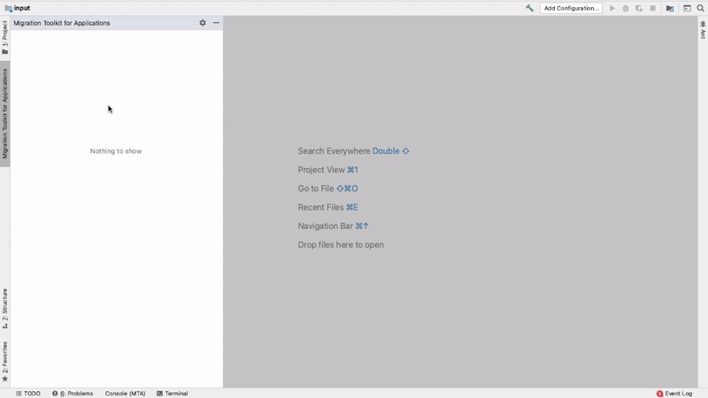

# Migration Toolkit for Applications (MTA) for IntelliJ

## Description

The IntelliJ plugin for the <b>Migration Toolkit for Applications</b> (MTA).

Migration Toolkit for Applications (MTA) (the product of the downstream project [Windup](https://github.com/windup/windup)) is a command-line Application Migration and Modernization Assessment tool.

> The documentation for MTA can be found [here](https://developers.redhat.com/products/mta/overview).

## What is MTA?
MTA is an extensible and customizable rule-based tool that simplifies the migration and modernization of Java applications.

## How does MTA simplify migration?
MTA looks for common resources and known trouble spots when migrating applications. It provides a high-level view of the technologies used by the application.

## How does the IntelliJ plugin assist with application migrations?
The IntelliJ plugin integrates with the MTA command-line tool, and provides assistance directly into the IntelliJ IDE.

This plugin expedites the process of analyzing your projects directly from within your IDE.
The tooling marks migration issues in the source code, provides guidance to fix the issues, and offers automatic code replacement when possible.

## Configuration Editor
Use the configuration editor to setup the analysis.

## Code Refactor
Jump to code containing identified migration issues and perform automatic code refactoring.

## Report
Use the generated reports to better understand and assess the migration efforts.

## Requirements

* Java Platform, `JDK version 11` with `JAVA_HOME` environment variable 
* A minimum of `4 GB RAM`; 8 GB recommended

> Tip: The mta-cli can be installed from within IntelliJ once the plugin has been installed.

=======

## License
[MIT](LICENSE)
